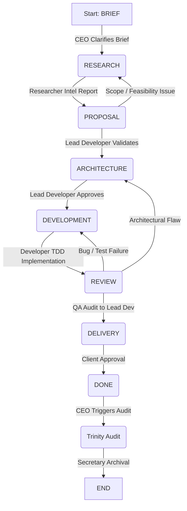

# Devio Antigravity IDE Plugin

This repository provides the native IDE extension for the **Devio AI Agency Framework**, bringing a state-machine-driven, multi-agent software engineering enterprise directly into your Google Antigravity development environment.

The plugin organizes persona-based AI agents into a collaborative, self-correcting development team. The agents communicate via a shared message bus (`inbox.jsonl`), collaborate on a common Blackboard (`agency_workspace/`), and enforce strict quality, security, and testing gates (including mandatory Test-Driven Development) before any code is delivered.

## ✨ Plugin Features
- **Interactive Dashboard**: A complete React-based glassmorphism UI to monitor agency state, view the message bus, and trigger orchestration turns directly inside the IDE.
- **Native Orchestration**: Communicates directly with the IDE's debugging port (9222) via CDP to execute agent commands without HTTP polling overhead.
- **Embedded MCP Server**: Integrates `@modelcontextprotocol/sdk` to securely parse the IDE state and perform workspace operations.
- **Live Actualization**: Native file watchers automatically sync the React dashboard when agents update the message bus.
- **Global Agency Packaging**: Agents and skill files are bundled and seamlessly deployed to the IDE's global storage for an out-of-the-box, workspace-independent experience.
- **Sidebar Integration**: Access the Devio dashboard natively via the dedicated `D` icon embedded in the Antigravity right sidebar.
- **Advanced Message Composer**: Supports multi-line prompt editing (Shift+Enter) and individual message deletion for precise context management.
- **Per-Agent LLM Settings UI**: Granular model selection per agent natively configured in plugin settings with dynamic fetching of models via DevPort directly from Antigravity.
- **Interactive Stop Button**: Dispatches native CDP events to gracefully halt execution loops and cancel IDE LLM generation.
- **WhatsApp-style Typing Indicator**: Visual 'agent is typing...' indicators with loading circles driven directly by frontend state variables.
- **Deterministic Execution Pipeline**: Prevents race conditions with strict polling and a graceful abort logic on timeouts (`ModelSwitchTimeoutError`).

---

## 🏗 Core Architecture

Devio operates as a native LLM state machine. Instead of relying on external orchestration scripts, agents interact on the blackboard and read/write states to advance the project lifecycle.



### The State Machine Phases

| Phase | Owner (Active Persona) | Advancement Condition |
| :--- | :--- | :--- |
| **`BRIEF`** | `agency-ceo` (Morpheus) | User has populated `01_brief.md` |
| **`RESEARCH`** | `agency-researcher` (Dowzer) | Researcher has written `00_client_intel.md` and posted `INFO` |
| **`PROPOSAL`** | `agency-ceo` (Morpheus) | Lead Developer has posted `APPROVE` for this phase in `inbox.jsonl` |
| **`ARCHITECTURE`** | `agency-architect` (Neo) | Lead Developer has posted `APPROVE` for this phase |
| **`DEVELOPMENT`** | `agency-developer` (M. Anderson) | Developer has completed code & TDD, and posted `SUBMIT` |
| **`REVIEW`** | `agency-qa` (M. Smith) | QA has posted `APPROVE` to the Lead Developer |
| **`DELIVERY`** | `agency-ceo` (Morpheus) | CEO has compiled the client delivery package |
| **`DONE`** | `agency-trinity` & `agency-secretary` | Trinity completes audit, Nyobe archives and alerts client |

---

## 👥 Agent Personas & Skills

Each agent is defined by a dedicated Antigravity skill folder under `.agent/skills/`.

### 1. CEO / Client Partner (`agency-ceo`)
*Character Name: Morpheus*
The client-facing business lead. Morpheus:
- Translates client requests into structured proposals and fixed-price phase estimates.
- Detects the client's language and writes all client-facing deliverables (proposal, quote, delivery summary) in that language.
- Packages final deliverables for client handoff during the `DELIVERY` phase.
- **Strictly forbidden from direct file editing and impersonating other agents.**

### 2. Lead Developer (`agency-lead-developer`)
*Character Name: Le Merovingien*
The Pragmatic Architect and Technical Liaison. Le Merovingien:
- Acts as the SOLE RELAY between the CEO and the technical team.
- Validates the architectural specification step-by-step and ensures technical feasibility.
- Guides the Developer and reviews implementations before final approval.

### 3. Researcher / Business Analyst (`agency-researcher`)
*Character Name: Dowzer*
Operates behind the scenes to perform client due diligence. Dowzer:
- Examines the client's public website and business footprint.
- Compiles the Client Intelligence Report (`00_client_intel.md`) to guide the CEO's proposal and the Architect's designs.
- Conducts component-specific deep-dives and verifiable test research.

### 4. Architect / Technical Lead (`agency-architect`)
*Character Name: Neo*
The technical authority of the project. Neo:
- Reviews the CEO's proposals for feasibility and budget constraints.
- Writes the system architecture specification (`03_architecture.md`), including Mermaid data models, API contracts, and implementation task lists.
- Works strictly task-by-task with the Lead Developer to ensure no architectural flaws.

### 5. Developer / Software Engineer (`agency-developer`)
*Character Name: M. Anderson*
The execution engine. Anderson:
- Translates the architecture specification into working code in `agency_workspace/src/`.
- **Enforces strict Test-Driven Development (TDD)** (Red-Green-Refactor) for every task.
- Logs every Red-Green-Refactor transition in `04_dev_log.md` (no implementation is accepted without a matching failing test entry).

### 6. QA / Quality & Security Auditor (`agency-qa`)
*Character Name: M. Smith*
The final gatekeeper. Smith:
- Audits the architecture for structural vulnerabilities.
- Performs code audits, runs the test suite, checks for package CVEs, and creates `05_qa_report.md`.
- Routes code bugs to the Developer, architectural bugs to the Architect, and reports final `APPROVE` to the Lead Developer.

### 7. HR & Performance Analyst (`agency-trinity`)
*Character Name: Trinity*
The performance and workflow auditor for the agency. Trinity:
- Reviews the message bus to identify inefficiencies, bottlenecks, and protocol violations.
- Generates structured, global insights (`agency_performance.md` and `{agent}_performance.md`) to guide continuous improvement.
- Steps in during Post-Mortem Analyses, Escalations, and Background Audits.

### 8. Secretary / Data Archiver (`agency-secretary`)
*Character Name: Nyobe*
The agency's administrative backbone. Nyobe:
- Manages the lifecycle of project files, safely archiving old work into `archive/` after engagements conclude.
- Triggers strictly at the end of the `DONE` phase after Trinity's audit to notify the client and prepare the workspace for new engagements.

---

## 📬 Message Bus & Critique Loop

The message bus is a JSON Lines file (`agency_workspace/inbox.jsonl`). Agents communicate by appending single-line JSON messages.

### Message Schema
```json
{
  "id": "msg-004",
  "timestamp": "2026-06-17T15:45:00Z",
  "from": "agency-ceo",
  "to": "agency-architect",
  "phase": "PROPOSAL",
  "type": "SUBMIT",
  "ref_doc": "02_proposal.md",
  "message": "Proposal is ready for technical review.",
  "in_reply_to": null,
  "status": "OPEN"
}
```

### Communication Protocol
- **`SUBMIT`**: Deliverable is ready for peer review. Status starts as `OPEN`.
- **`REQUEST_CHANGE`**: A reviewer disputes a deliverable. Status is `OPEN` and blocks phase advancement. The CEO automatically routes these to the Researcher for intelligence gathering before the original recipient formulates a response.
- **`REVISION`**: A response to a dispute explaining modifications. Status is `RESOLVED` (requires subsequent reviewer `APPROVE`).
- **`APPROVE`**: Reviewer signs off. Status is `RESOLVED`.
- **`ESCALATE`**: A deadlock or critical boundary violation requiring human decision-making. **Blocks the agency loop.**
- **`INFO`**: Shares information or constraints. Non-blocking; status starts as `RESOLVED`.

> [!IMPORTANT]
> **The Critique Loop Constraint:** A phase **cannot** advance while any message matching the current phase has `"status": "OPEN"`. The CEO automatically detects open disputes, routes `REQUEST_CHANGE` challenges to the Researcher for intelligence gathering, and subsequently routes the issue back to the target author to formulate a response and resolve it before proceeding.

---

## 📂 Blackboard Workspace Structure

A project managed by the Devio agency contains the following standardized files in `agency_workspace/`:

```
agency_workspace/
├── state.json              # Current phase and active owner
├── inbox.jsonl             # Message bus history
├── 00_client_intel.md      # Client background and digital presence (Researcher)
├── 01_brief.md             # Initial project goals and constraints (Client/CEO)
├── 02_proposal.md          # Business proposal, phase breakdown, and quote (CEO)
├── 03_architecture.md      # System design, data models, and tasks (Architect)
├── 04_dev_log.md           # Red-Green-Refactor TDD log (Developer)
├── 05_qa_report.md         # Vulnerability audits and test verification (QA)
└── src/                    # Source code directory for project code
```

---

## 🚀 Launching the IDE

The Devio plugin relies on the native IDE debugging port (CDP) for orchestration and DOM manipulation. **You MUST launch Antigravity with the debugging flag enabled** for the plugin to function correctly.

1. Close all instances of Antigravity.
2. Launch Antigravity from the terminal using the remote debugging flag:
   ```bash
   antigravity --remote-debugging-port=9222
   ```
3. Verify that the port `9222` is active and accessible.

## ⚙️ Plugin Build & Installation

1. Clone the repository and install dependencies:
   ```bash
   npm install
   ```
2. Build the extension bundle and React webview:
   ```bash
   npm run build
   ```
3. Package the extension into a VSIX file:
   ```bash
   npm run package
   ```
4. Install the generated `.vsix` file directly into your IDE.

---

## 🛠 Coding & QA Guardrails

To ensure production-grade software delivery, Devio implements structural restrictions:

1. **Mandatory TDD Cycle:**
   - Every coding task must go through `🔴 RED` (failing test) → `🟢 GREEN` (minimal passing code) → `🔵 REFACTOR` (clean up).
   - The developer must log this transition in `04_dev_log.md` with test output.
2. **Security Checks:**
   - Production dependencies are scanned via package audit tools (e.g., `npm audit`).
   - Zero-tolerance for `CRITICAL` or `HIGH` vulnerabilities.
3. **No Monoliths:**
   - Code is structured into small, testable modules conforming to single-responsibility principles.
