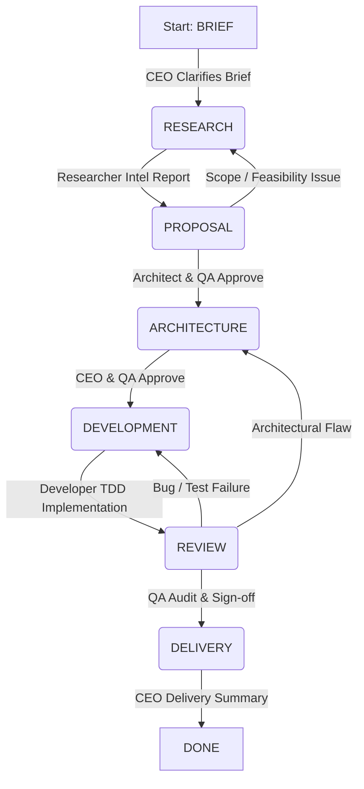

# Devio Antigravity IDE Plugin

This repository provides the native IDE extension for the **Devio AI Agency Framework**, bringing a state-machine-driven, multi-agent software engineering enterprise directly into your Google Antigravity development environment.

The plugin organizes persona-based AI agents into a collaborative, self-correcting development team. The agents communicate via a shared message bus (`inbox.jsonl`), collaborate on a common Blackboard (`agency_workspace/`), and enforce strict quality, security, and testing gates (including mandatory Test-Driven Development) before any code is delivered.

## ✨ Plugin Features
- **Interactive Dashboard**: A complete React-based glassmorphism UI to monitor agency state, view the message bus, and trigger orchestration turns directly inside the IDE.
- **Native Orchestration**: Communicates directly with the IDE's debugging port (9222) via CDP to execute agent commands without HTTP polling overhead.
- **Embedded MCP Server**: Integrates `@modelcontextprotocol/sdk` to securely parse the IDE state and perform workspace operations.
- **Live Actualization**: Native file watchers automatically sync the React dashboard when agents update the message bus.
- **Global Agency Packaging**: Agents and skill files are bundled and seamlessly deployed to the IDE's global storage for an out-of-the-box, workspace-independent experience.
- **Sidebar Integration**: Access the Devio dashboard natively via the dedicated `D` icon embedded in the Antigravity right sidebar.
- **Advanced Message Composer**: Supports multi-line prompt editing (Shift+Enter) and individual message deletion for precise context management.

---

## 🏗 Core Architecture

Devio operates as a native LLM state machine. Instead of relying on external orchestration scripts, agents interact on the blackboard and read/write states to advance the project lifecycle.



### The State Machine Phases

| Phase | Owner (Active Persona) | Advancement Condition |
| :--- | :--- | :--- |
| **`BRIEF`** | `agency-ceo` (Morpheus) | User has populated `01_brief.md` |
| **`RESEARCH`** | `agency-researcher` (Dowzer) | Researcher has written `00_client_intel.md` and posted `INFO` |
| **`PROPOSAL`** | `agency-ceo` (Morpheus) | Architect has posted `APPROVE` for this phase in `inbox.jsonl` |
| **`ARCHITECTURE`** | `agency-architect` (Neo) | CEO **and** QA have both posted `APPROVE` for this phase |
| **`DEVELOPMENT`** | `agency-developer` (M. Anderson) | Developer has completed code & TDD, and posted `SUBMIT` |
| **`REVIEW`** | `agency-qa` (M. Smith) | QA has posted `APPROVE` for this phase (all issues resolved) |
| **`DELIVERY`** | `agency-ceo` (Morpheus) | CEO has compiled the client delivery package |
| **`DONE`** | None | Engagement is complete |

---

## 👥 Agent Personas & Skills

Each agent is defined by a dedicated Antigravity skill folder under `.agent/skills/`.

### 1. Coordinator (`agency-coordinator`)
The silent manager of the state machine. It does not interface with the client. It reads the Blackboard (`agency_workspace/`), checks for unresolved disputes in the message bus, updates `state.json` when advancement criteria are met, and routes work by loading the correct persona skill.

### 2. CEO / Client Partner (`agency-ceo`)
*Character Name: Morpheus*
The client-facing business lead. Morpheus:
- Translates client requests into structured proposals and fixed-price phase estimates.
- Detects the client's language and writes all client-facing deliverables (proposal, quote, delivery summary) in that language.
- Packages final deliverables for client handoff during the `DELIVERY` phase.

### 3. Researcher / Business Analyst (`agency-researcher`)
*Character Name: Dowzer*
Operates behind the scenes to perform client due diligence. Dowzer:
- Examines the client's public website and business footprint.
- Compiles the Client Intelligence Report (`00_client_intel.md`) to guide the CEO's proposal and the Architect's designs.

### 4. Architect / Technical Lead (`agency-architect`)
*Character Name: Neo*
The technical authority of the project. Neo:
- Reviews the CEO's proposals for feasibility and budget constraints.
- Writes the system architecture specification (`03_architecture.md`), including Mermaid data models, API contracts, and implementation task lists.
- Re-evaluates design if QA escalates structural issues during code review.

### 5. Developer / Software Engineer (`agency-developer`)
*Character Name: M. Anderson*
The execution engine. Anderson:
- Translates the architecture specification into working code in `agency_workspace/src/`.
- **Enforces strict Test-Driven Development (TDD)** (Red-Green-Refactor) for every task.
- Logs every Red-Green-Refactor transition in `04_dev_log.md` (no implementation is accepted without a matching failing test entry).

### 6. QA / Quality & Security Auditor (`agency-qa`)
*Character Name: M. Smith*
The final gatekeeper. Smith:
- Audits the architecture for structural vulnerabilities.
- Performs code audits, runs the test suite, checks for package CVEs, and creates `05_qa_report.md`.
- Routes code bugs to the Developer, architectural bugs to the Architect, and business/compliance issues to the CEO.

---

## 📬 Message Bus & Critique Loop

The message bus is a JSON Lines file (`agency_workspace/inbox.jsonl`). Agents communicate by appending single-line JSON messages.

### Message Schema
```json
{
  "id": "msg-004",
  "timestamp": "2026-06-17T15:45:00Z",
  "from": "agency-ceo",
  "to": "agency-architect",
  "phase": "PROPOSAL",
  "type": "SUBMIT",
  "ref_doc": "02_proposal.md",
  "message": "Proposal is ready for technical review.",
  "in_reply_to": null,
  "status": "OPEN"
}
```

### Communication Protocol
- **`SUBMIT`**: Deliverable is ready for peer review. Status starts as `OPEN`.
- **`REQUEST_CHANGE`**: A reviewer disputes a deliverable. Status is `OPEN` and blocks phase advancement. The Coordinator automatically routes these to the Researcher for intelligence gathering before the original recipient formulates a response.
- **`REVISION`**: A response to a dispute explaining modifications. Status is `RESOLVED` (requires subsequent reviewer `APPROVE`).
- **`APPROVE`**: Reviewer signs off. Status is `RESOLVED`.
- **`ESCALATE`**: A deadlock or critical boundary violation requiring human decision-making. **Blocks the coordinator loop.**
- **`INFO`**: Shares information or constraints. Non-blocking; status starts as `RESOLVED`.

> [!IMPORTANT]
> **The Critique Loop Constraint:** A phase **cannot** advance while any message matching the current phase has `"status": "OPEN"`. The coordinator automatically detects open disputes, routes `REQUEST_CHANGE` challenges to the Researcher for intelligence gathering, adopts the recipient persona, resolves the issue, and marks it `RESOLVED` before proceeding.

---

## 📂 Blackboard Workspace Structure

A project managed by the Devio agency contains the following standardized files in `agency_workspace/`:

```
agency_workspace/
├── state.json              # Current phase and active owner
├── inbox.jsonl             # Message bus history
├── 00_client_intel.md      # Client background and digital presence (Researcher)
├── 01_brief.md             # Initial project goals and constraints (Client/CEO)
├── 02_proposal.md          # Business proposal, phase breakdown, and quote (CEO)
├── 03_architecture.md      # System design, data models, and tasks (Architect)
├── 04_dev_log.md           # Red-Green-Refactor TDD log (Developer)
├── 05_qa_report.md         # Vulnerability audits and test verification (QA)
└── src/                    # Source code directory for project code
```

---

## ⚙️ Plugin Build & Installation

1. Clone the repository and install dependencies:
   ```bash
   npm install
   ```
2. Build the extension bundle and React webview:
   ```bash
   npm run build
   ```
3. Package the extension into a VSIX file:
   ```bash
   npm run package
   ```
4. Install the generated `.vsix` file directly into your IDE.

---

## 🛠 Coding & QA Guardrails

To ensure production-grade software delivery, Devio implements structural restrictions:

1. **Mandatory TDD Cycle:**
   - Every coding task must go through `🔴 RED` (failing test) → `🟢 GREEN` (minimal passing code) → `🔵 REFACTOR` (clean up).
   - The developer must log this transition in `04_dev_log.md` with test output.
2. **Security Checks:**
   - Production dependencies are scanned via package audit tools (e.g., `npm audit`).
   - Zero-tolerance for `CRITICAL` or `HIGH` vulnerabilities.
3. **No Monoliths:**
   - Code is structured into small, testable modules conforming to single-responsibility principles.
