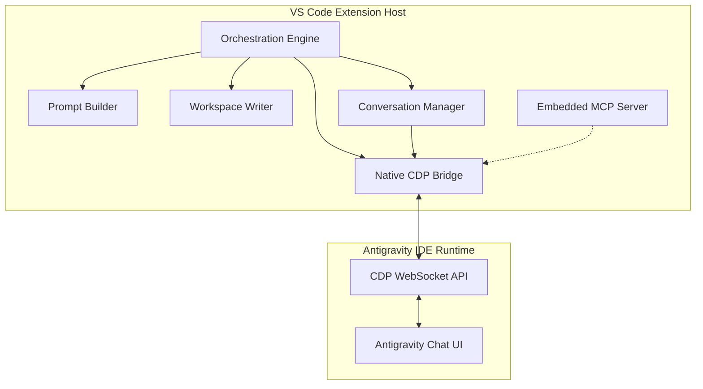

# Architecture Document — Devio Autonomous Agency Engine V3 (Native Merge)

**Prepared by:** agency-architect (Neo)
**Date:** 2026-06-18
**Status:** SUBMITTED
**Reference Phase:** ARCHITECTURE

---

## 1. System Overview

The Devio plugin is being upgraded to a native autonomous agency engine (V3). Instead of the previous brittle HTTP polling to a separate extension bridge, the Devio plugin will integrate the Chrome DevTools Protocol (CDP) services directly. This integration allows the extension to orchestrate the Antigravity IDE chat panel natively, including window management, executing conversation flows, and interpreting outputs from the chat UI DOM.

The primary system goal is to autonomously step through the agency phases (BRIEF → RESEARCH → PROPOSAL → ARCHITECTURE → DEVELOPMENT → REVIEW → DELIVERY) by programmatically exchanging prompts and responses with the active Antigravity session.

---

## 2. Architecture Diagram



---

## 3. Component Breakdown

### 3.1. Native CDP Bridge (`src/services/cdp.ts`)
- **Purpose:** Connects to the IDE's debugging port, resolves targets, and executes CDP commands (`Runtime.evaluate`, `DOM.querySelector`).
- **Tech Choice:** `ws` (WebSocket client) >= 8.18.0. Native CDP eliminates HTTP API fragility.
- **Rationale:** Merged directly from the Option B fork to gain robust, battle-tested window targeting and DOM injection logic.

### 3.2. Conversation Manager (`src/orchestration/conversation.ts`)
- **Purpose:** Manages context isolation between agent personas. Triggers a "New Chat" click event via the Native CDP Bridge before each agent turn (unless disabled).
- **Tech Choice:** TypeScript class wrapping CDP click logic.
- **Rationale:** Prevents context window cross-contamination (e.g., the Developer agent getting confused by the CEO's proposal text).

### 3.3. Prompt Builder (`src/orchestration/promptBuilder.ts`)
- **Purpose:** Assembles the final agent prompt by combining the Persona SKILL.md, current phase requirements, and relevant `agency_workspace` file contents.
- **Tech Choice:** Node.js `fs.promises`.
- **Rationale:** Pure standard library IO logic.

### 3.4. Workspace Writer (`src/orchestration/workspaceWriter.ts`)
- **Purpose:** Parses the raw HTML snapshot returned by the CDP Bridge, extracts the agent's textual output, identifies tagged blocks (e.g., `file:///...` links and markdown), and atomically updates the local files and `inbox.jsonl`.
- **Tech Choice:** `cheerio` >= 1.0.0-rc.12.
- **Rationale:** Regex-based HTML parsing is prohibited due to brittleness. `cheerio` provides robust DOM manipulation for extracting agent payloads accurately.

### 3.5. Orchestration Engine (`src/orchestration/engine.ts`)
- **Purpose:** The main loop that reads `state.json`, activates the correct phase, polls the Native CDP Bridge for completion (`isGenerating: false`), and delegates to the `WorkspaceWriter`.
- **Tech Choice:** TypeScript State Machine implementation.
- **Rationale:** Standard pattern for sequential phase execution. Also integrates with the `devio.autonomyMode` setting.

### 3.6. Embedded MCP Server (`src/server/mcp-server.mjs`)
- **Purpose:** Exposes agency tools locally for interoperability with external agent environments.
- **Tech Choice:** `@modelcontextprotocol/sdk` (Current Stable).
- **Rationale:** Fulfills client requirement to natively host MCP capabilities without requiring an external process.

---

## 4. API Contract

The primary boundary is internal. The Orchestration Engine interacts with the `NativeBridge` interface:

```typescript
interface INativeBridge {
  connectCDP(port: number): Promise<void>;
  captureSnapshot(): Promise<{ html: string, isGenerating: boolean }>;
  injectMessage(text: string): Promise<void>;
  clickButton(text: string): Promise<void>;
}

// Webview IPC Contract extensions
interface IWebviewIPC {
  command: 'clearChat'; // triggers deletion of inbox.jsonl contents and resets conversation state
}
```

---

## 5. Data Model

The primary data structures remain unchanged from V2, persisting via file I/O:

| Entity | Schema Location | Storage |
|:---|:---|:---|
| **State** | `references/state_schema.md` | `agency_workspace/state.json` |
| **Message** | `references/message_types.md` | `agency_workspace/inbox.jsonl` (Append-only) |

---

## 6. Infrastructure & Deployment

- **Runtime:** Node.js >= 22 (Active LTS, EOL April 2027) — the VS Code extension host environment.
- **Dependencies:** 
  - `ws` (Current stable) for WebSocket CDP connectivity.
  - `cheerio` (Current stable) for robust HTML parsing in Workspace Writer.
  - `@modelcontextprotocol/sdk` (Current stable) for the embedded server.
- **Deployment:** Packaged and distributed as a single `.vsix` extension.
- **Security & Data:** TLS is out of scope as CDP connects via `ws://127.0.0.1` locally. Antigravity plugin does not store prompt content; history is maintained natively by the Antigravity IDE.

---

## 7. Implementation Task List

| Task ID | Task Name | Est. Hours | Dependencies | Acceptance Criteria |
|:---|:---|:---|:---|:---|
| **T-01** | **Project Setup & Settings** | 1h | None | `package.json` contains `ws`, `cheerio`, and MCP SDK. `devio.autonomyMode` and `devio.freshConversationPerTurn` settings are declared. |
| **T-02** | **Merge CDP Services** | 4h | T-01 | Fork's `src/services/` logic is merged. `NativeBridge` can successfully connect to Antigravity via CDP and invoke `captureSnapshot()`. |
| **T-03** | **Workspace Writer & Parser** | 6h | T-01 | `WorkspaceWriter` accurately parses sample Antigravity HTML using `cheerio` and extracts message text and code blocks. |
| **T-04** | **Prompt Builder & Conversation Mgr** | 4h | T-02 | `PromptBuilder` merges files. `ConversationManager` successfully clicks the "New Chat" button via CDP before prompt injection. |
| **T-05** | **Orchestrator Loop** | 8h | T-02, T-03, T-04 | The engine runs headless through a mocked full lifecycle (BRIEF to DONE), correctly updating `state.json` and `inbox.jsonl`. |
| **T-06** | **Embedded MCP Integration** | 2h | T-02 | `mcp-server.mjs` is bundled and responding to local JSON-RPC requests on the standard transport. |
| **T-07** | **Final Tests & QA** | 5h | All above | Extension builds into a `.vsix` with zero QA severity (CRITICAL/HIGH) defects. |
| **T-08** | **Clear Chat Feature** | 2h | T-07 | Webview UI has a 'Clear Chat' button that sends `clearChat` IPC command. Extension host listens to it, truncates `inbox.jsonl`, and updates the UI state. |

**Total Estimated Hours:** 32h

---

## 8. Open Technical Decisions

1. **CDP Selectors:** The "New Chat" click selector may drift with Antigravity IDE updates. It is deferred to implementation to parameterize these selectors so they can be patched rapidly without core rewrites.
2. **MCP Transport:** By default, the MCP server operates over `stdio`. Its exact activation vector (whether launched as a persistent sidecar thread by the extension host) will be formalized during T-06 implementation based on stability testing.
