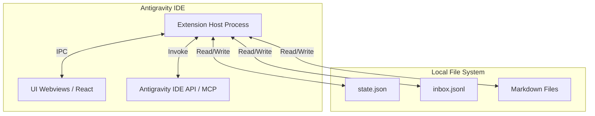

# Architecture Specification: Devio Antigravity IDE Plugin

**Prepared by:** agency-architect (Neo)
**Date:** 2026-06-17

---

## 1. System Overview

The Devio Antigravity IDE Plugin is a local extension designed to operate within the Antigravity IDE environment. It acts as a graphical interface over the Devio framework, bridging the gap between developers and the underlying JSONL message bus and Markdown-based blackboard (`agency_workspace`). The plugin will use native Webviews for its UI components and communicate directly with the local file system and Antigravity IDE APIs to orchestrate AI agent personas.

---

## 2. Architecture Diagram



---

## 3. Component Breakdown

| Component | Purpose | Technology Choice | Rationale |
|:---|:---|:---|:---|
| **Extension Host** | Main entry point handling lifecycle, commands, and file watching. | TypeScript, Node.js 24 LTS | Standard runtime for modern IDE extensions. Node 24 LTS is actively supported. |
| **UI Webviews** | Render the Dashboard, Chat, and Editor interfaces natively inside the IDE. | React 18, Vite | React 18 is stable and efficient for complex UIs; Vite ensures rapid HMR during extension development. |
| **Workspace Manager** | Service abstraction for reading, parsing, and writing workspace files safely. | Node `fs/promises` | Native file I/O is most performant; avoids unnecessary third-party dependencies. |
| **Antigravity Bridge** | Integration layer triggering AI agent routines. | MCP (Model Context Protocol) / Extension API | MCP is the standard for IDE agent interactions as identified during research. |

---

## 4. API Contract

The primary data contracts involve the internal state and the message bus.

**Workspace State (`state.json`):**
```typescript
interface AgencyState {
  phase: "BRIEF" | "RESEARCH" | "PROPOSAL" | "ARCHITECTURE" | "DEVELOPMENT" | "REVIEW" | "DELIVERY" | "DONE";
  owner: string;
  project: string;
  client: string;
  started_at: string;
  updated_at: string;
  blocked_by: string[];
}
```

**Message Bus (`inbox.jsonl`):**
```typescript
interface AgencyMessage {
  id: string;
  timestamp: string;
  from: string;
  to: string;
  phase: string;
  type: "SUBMIT" | "REQUEST_CHANGE" | "REVISION" | "APPROVE" | "ESCALATE" | "INFO";
  ref_doc: string | null;
  message: string;
  in_reply_to: string | null;
  status: "OPEN" | "RESOLVED";
}
```

---

## 5. Security (Pre-build)

- **Authentication:** N/A. The plugin runs entirely locally within the user's IDE context and assumes the host environment is secure.
- **Authorisation:** N/A. Access is granted implicitly by file system permissions on the workspace.
- **Secrets Management:** The plugin itself requires no secrets. Any API keys required by Antigravity are handled by the host IDE.
- **Input Validation:** Webview inputs (e.g., chat messages, brief forms) will be sanitized before being written to `inbox.jsonl` or `.md` files to prevent command injection or malformed JSON errors.

---

## 6. Infrastructure & Deployment

- **Environment:** Runs locally inside the user's Antigravity IDE instance.
- **Packaging:** Bundled via `esbuild` and packaged into a `.vsix` file (or equivalent Antigravity plugin format) for manual distribution.
- **Cloud Costs:** €0.00. No dedicated external infrastructure is required.

---

## 7. Implementation Task List

| Task | Description | Estimate | Dependencies | Acceptance Criteria |
|:---|:---|:---|:---|:---|
| **T01** | Scaffold Extension Project | 4h | None | Project builds successfully with `esbuild` and produces a valid extension manifest. |
| **T02** | Implement Workspace Manager | 6h | T01 | Service can read/write `state.json` and append to `inbox.jsonl` without corrupting files. |
| **T03** | Create React Webview Provider | 8h | T01 | Extension can spawn a Webview panel that renders a basic React 18 component. |
| **T04** | Develop Dashboard UI | 8h | T02, T03 | Dashboard accurately displays the current phase and parses the inbox history. |
| **T05** | Implement Antigravity Bridge | 6h | T01 | Plugin can successfully invoke a test command via the Antigravity IDE API/MCP. |
| **T06** | Package and Manual Testing | 4h | T04, T05 | The final extension builds into a distributable file and installs cleanly in the IDE. |

---

## 8. Open Technical Decisions

- **Exact API Hook for Antigravity:** While MCP is assumed, the exact command ID required to trigger the `agency-coordinator` within Antigravity IDE must be confirmed during T05 implementation. If no programmatic hook is available, a fallback command invoking the terminal CLI will be used.
