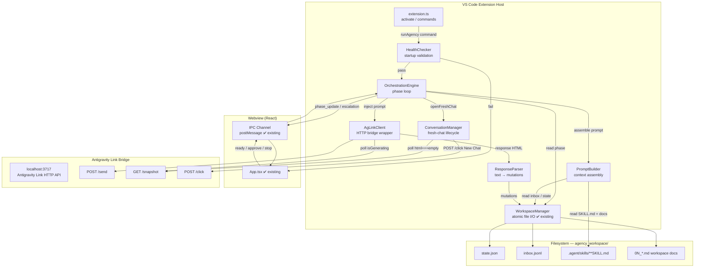
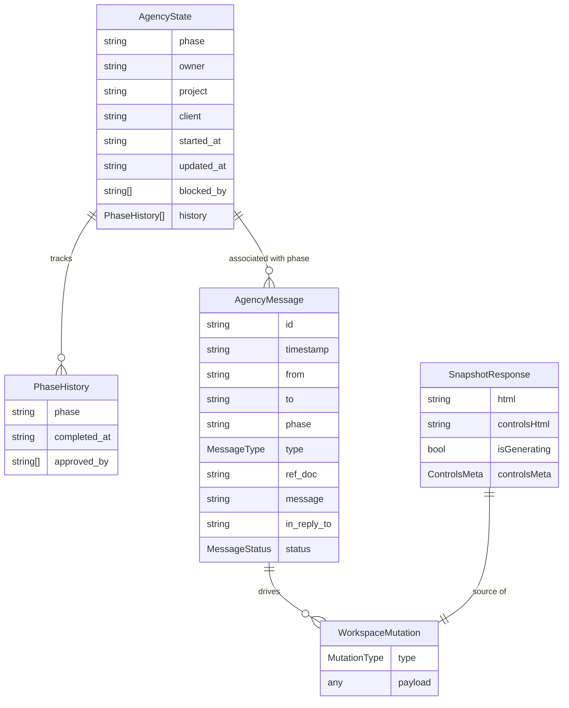

# Architecture Specification — Devio Autonomous Orchestration Engine V2

**Prepared by:** Neo, Senior Solution Architect — Devio
**Date:** 2026-06-18
**Version:** 2.0
**Status:** SUBMITTED — awaiting CEO and QA APPROVE

---

## 1. System Overview

The V2 engine transforms the existing Devio VS Code extension from a passive dashboard into an autonomous agency runtime. It is a **TypeScript orchestration loop** embedded in the extension host process. On user trigger ("Run Agency"), the engine iterates over the agency phase lifecycle by:

1. Reading the current phase from `state.json`
2. Assembling a structured prompt from the active agent's SKILL.md and relevant workspace documents
3. Opening a fresh Antigravity conversation (`ConversationManager`)
4. Injecting the prompt into the active Antigravity IDE session via the **Antigravity Link HTTP bridge**
5. Polling the bridge until generation is complete, then extracting the agent's response text
6. Parsing the response to derive workspace mutations (file writes, inbox entries, state transitions)
7. Applying mutations atomically via the existing `WorkspaceManager`
8. Advancing `state.json` and repeating — until `DONE` or a human escalation is required

All new components are **additive** to the V1 plugin. Existing `WorkspaceManager`, `WebviewProvider`, and IPC channel are retained and extended, not replaced.

---

## 2. Architecture Diagram



---

## 3. Component Breakdown

### 3.1 `AgLinkClient` — Antigravity Link HTTP Wrapper

**Purpose:** Typed, authenticated wrapper for all calls to the Antigravity Link HTTP bridge.

**Technology:** TypeScript class, Node.js built-in `fetch` (available in VS Code extension host ≥ Node 18).

**Rationale:** Isolates all HTTP concerns from orchestration logic; makes the bridge mockable in tests without additional libraries.

**Interface:**

```typescript
interface SnapshotResponse {
  html: string;          // cleaned chat surface HTML
  controlsHtml: string;  // full body HTML (used by ConversationManager)
  isGenerating: boolean;
  controlsMeta: {
    isGenerating: boolean;
    model: { text: string; selector: string };
  };
}

class AgLinkClient {
  constructor(
    private baseUrl: string,    // e.g. "https://localhost:3717"
    private token: string       // from SecretStorage
  ) {}

  async ping(): Promise<{ ok: boolean; version?: string }>
  async send(message: string): Promise<{ success: boolean; method: string }>
  async snapshot(): Promise<SnapshotResponse>
  async click(opts: { text?: string; selector?: string }): Promise<{ success: boolean }>
  async waitForCompletion(opts: { pollIntervalMs: number; timeoutMs: number }): Promise<SnapshotResponse>
  async extractResponse(snapshot: SnapshotResponse): Promise<string>
}
```

**Key behaviours:**
- All requests include `Authorization: Bearer <token>` and `Content-Type: application/json`.
- **TLS scoping (QA-ARCH-001):** Antigravity Link uses a self-signed certificate. TLS verification is disabled **per-instance only** using `undici.Agent` — the built-in undici library available in Node.js ≥ 22 without any npm install:
  ```typescript
  import { Agent } from 'undici';
  const dispatcher = new Agent({ connect: { rejectUnauthorized: false } });
  // All fetch calls inside AgLinkClient pass { dispatcher } as the third argument:
  // fetch(url, { ...options, dispatcher })
  ```
  The `dispatcher` is constructed once inside `AgLinkClient` at instantiation and **never** assigned to `process.env.NODE_TLS_REJECT_UNAUTHORIZED`. Setting that environment variable globally is explicitly forbidden — it would disable TLS verification for all outbound HTTPS calls from the entire VS Code extension host process.
- `waitForCompletion` polls `GET /snapshot` every `pollIntervalMs` ms until `isGenerating === false`, or throws `TimeoutError` after `timeoutMs`.
- `extractResponse` targets a configurable CSS selector (`devio.responseSelector`, default: last `.message.assistant` or equivalent) to extract text from the `html` field. Falls back to full `html` text content if selector yields no match.

---

### 3.2 `ConversationManager` — Fresh Chat Lifecycle

**Purpose:** Opens a clean Antigravity conversation before each agent turn to prevent context contamination between agents.

**Technology:** TypeScript class, depends on `AgLinkClient`.

**Rationale:** Researcher and Architect must not see each other's full conversation history. Each agent gets a blank context window.

**Interface:**

```typescript
class ConversationManager {
  constructor(private client: AgLinkClient, private config: ConversationConfig) {}

  async openFreshChat(): Promise<void>
  // Attempts POST /click {"text": "New Chat"}
  // Polls GET /snapshot until html === "" OR controlsHtml indicates empty state
  // Throws ConversationResetError (with cause) if timeout exceeded
  // On ConversationResetError: logs WARN to webview, continues (degraded isolation mode)
}

interface ConversationConfig {
  newChatSelector: string;    // devio.newChatSelector, default: button text "New Chat"
  timeoutMs: number;          // hard cap: 10_000 ms (10 seconds)
  pollIntervalMs: number;     // default: 500 ms
}
```

**Algorithm:**

```
1. POST /click { "text": config.newChatSelector }
2. Start timer (deadline = now + config.timeoutMs)
3. LOOP:
   a. GET /snapshot
   b. if snapshot.html.trim() === "" → return (success)
   c. if now > deadline → throw ConversationResetError("Timed out waiting for blank conversation after 10s")
   d. sleep pollIntervalMs
4. (never reached)
```

**Constraint (from Architect approval, msg-v2-009):** The timeout cap is **10 000 ms**. This is not configurable — it prevents an infinite hang from silently stalling the engine.

---

### 3.3 `PromptBuilder` — Context Assembler

**Purpose:** Assembles the structured prompt string for a given agency phase and persona.

**Technology:** TypeScript class, uses `fs/promises` to read SKILL.md files and workspace documents.

**Rationale:** Decoupling prompt construction from orchestration logic allows prompts to be unit-tested against known expected outputs without invoking the bridge.

**Interface:**

```typescript
interface PromptContext {
  phase: string;
  skillPath: string;         // absolute path to SKILL.md
  workspaceDocs: string[];   // absolute paths to include as context (brief, intel, prior deliverables)
  inboxMessages: AgencyMessage[];
  state: AgencyState;
}

class PromptBuilder {
  async build(ctx: PromptContext): Promise<string>
  // Returns a structured string:
  // [SYSTEM: content of SKILL.md]
  // [CONTEXT: concatenated workspace documents, labelled by filename]
  // [INBOX: last N inbox messages as JSON]
  // [TASK: phase-specific instruction]
}
```

**Phase-to-document mapping** (drives which files are included per phase):

| Phase | SKILL.md | Workspace Docs |
|:------|:---------|:---------------|
| BRIEF | agency-ceo | — |
| RESEARCH | agency-researcher | 01_brief.md |
| PROPOSAL | agency-ceo | 00_client_intel.md, 01_brief.md |
| ARCHITECTURE | agency-architect | 00_client_intel.md, 01_brief.md, 02_proposal.md |
| DEVELOPMENT | agency-developer | 03_architecture.md, inbox (open msgs) |
| REVIEW | agency-qa | 03_architecture.md, 04_dev_log.md, src/ file list |
| DELIVERY | agency-ceo | 02_proposal.md, 03_architecture.md, 05_qa_report.md |

---

### 3.4 `ResponseParser` — Agent Output → Workspace Mutations

**Purpose:** Parses the agent's free-form text response and derives a list of concrete workspace mutations.

**Technology:** TypeScript class, pure functions (no I/O).

**Rationale:** Agents return free-form text. A structured response contract enforced in SKILL.md ensures parseable outputs. This component implements that contract's parser.

**Structured Response Contract (to be embedded in all SKILL.md files):**

Agents MUST wrap any file-write instructions in tagged blocks:

```
<<<FILE: path/relative/to/agency_workspace>>>
file content here
<<<END_FILE>>>
```

Agents MUST wrap inbox messages in:

```
<<<INBOX>>>
{"id": "msg-XXX", "from": "...", ...}
<<<END_INBOX>>>
```

Agents MUST wrap state transitions in:

```
<<<STATE_TRANSITION: NEXT_PHASE>>>
```

**Interface:**

```typescript
interface WorkspaceMutation {
  type: 'write_file' | 'append_inbox' | 'advance_state' | 'escalate';
  payload: any;
}

class ResponseParser {
  parse(responseText: string, currentPhase: string): WorkspaceMutation[]
  // Returns ordered list of mutations to apply.
  // Unknown or malformed blocks are logged as WARN and skipped — never thrown.
}
```

**Fallback:** If no tagged blocks are found, the full response text is written to `04_dev_log.md` as a raw log entry (agent spoke but produced no parseable actions — degraded, not a crash).

---

### 3.5 `OrchestrationEngine` — The Loop

**Purpose:** Sequences all components into the phase lifecycle loop.

**Technology:** TypeScript class, runs entirely in the extension host process (no worker threads, no child processes). Uses `async/await` — non-blocking.

**Interface:**

```typescript
class OrchestrationEngine {
  constructor(deps: {
    client: AgLinkClient;
    conversation: ConversationManager;
    promptBuilder: PromptBuilder;
    parser: ResponseParser;
    workspace: WorkspaceManager;
    emitter: EngineEventEmitter;  // fires events to webview IPC
  }) {}

  async run(opts: { mode: 'full' | 'supervised' }): Promise<void>
  stop(): void   // sets a cancellation flag; current phase completes cleanly before stopping
}
```

**Loop pseudocode:**

```
while state.phase !== 'DONE' and not cancelled:
  1. read state.json  →  currentPhase, owner
  2. check inbox for OPEN blockers → if ESCALATE exists: emit escalation event, pause
  3. openFreshChat()  [ConversationManager — timeout guarded]
  4. build prompt    [PromptBuilder]
  5. send prompt     [AgLinkClient.send()]
  6. wait for completion [AgLinkClient.waitForCompletion(pollInterval=2000, timeout=120000)]
  7. extract response text [AgLinkClient.extractResponse()]
  8. parse mutations  [ResponseParser.parse()]
  9. apply mutations  [WorkspaceManager — atomic, locked]
  10. emit phase_update event → webview
  11. if mode === 'supervised':
        emit pause_for_approval event → webview
        await user approval (webview posts 'approve' or 'stop')
  12. advance state → next phase
```

**Error handling invariant:** If any step throws an unrecoverable error (network failure, parse failure, lock timeout), the engine:
1. Does **not** modify `state.json`.
2. Emits an `engine_error` event to the webview with the error message.
3. Stops the loop (does not retry automatically — requires user to re-trigger).

---

### 3.6 `HealthChecker` — Startup Validation

**Purpose:** Validates prerequisites before the engine is allowed to start. Prevents silent failures mid-run.

**Technology:** TypeScript class, depends on `AgLinkClient`.

**Interface:**

```typescript
interface HealthResult {
  ok: boolean;
  checks: {
    bridgeReachable: boolean;     // GET /snapshot responds 200
    authValid: boolean;           // 401 = bad token
    newChatWorks: boolean;        // POST /click "New Chat" responded success
    portUsed: number;             // the port actually tested
  };
  errorMessage?: string;          // human-readable, names the port explicitly
}

class HealthChecker {
  async check(): Promise<HealthResult>
}
```

**On failure:** The webview displays an interactive setup guide (inline HTML). The "Run Agency" button is disabled until health check passes. Error messages always include the configured port (e.g. `"Cannot reach Antigravity Link at https://localhost:3717 — is the server running on port 3717?"`).

---

### 3.7 Webview Extensions (existing `App.tsx` + IPC)

The existing React webview is extended with three new UI elements. No redesign.

| Element | Description |
|:--------|:------------|
| **Run Agency button** | Triggers `runAgency` command. Disabled if health check fails or engine is running. |
| **Engine status strip** | Shows current engine state: `IDLE`, `RUNNING (Phase X)`, `PAUSED — awaiting approval`, `ERROR`. |
| **Supervised mode approval prompt** | When engine pauses between phases, shows "Continue →" and "Stop ■" buttons. Posts `approve` or `stop` to the extension host. |

**New IPC message types (extension → webview):**

```typescript
{ type: 'engine_status'; status: 'idle' | 'running' | 'paused' | 'error'; phase?: string; agent?: string }
{ type: 'engine_error'; message: string }
{ type: 'pause_for_approval'; phase: string; summary: string }
{ type: 'health_result'; result: HealthResult }
```

**New IPC message types (webview → extension):**

```typescript
{ command: 'runAgency'; mode: 'full' | 'supervised' }
{ command: 'approve' }
{ command: 'stop' }
```

---

## 4. API Contract

### 4.1 Antigravity Link API (consumed by `AgLinkClient`)

Base URL: `https://localhost:{devio.antigravityLinkPort}` (default port: **3717**)
Auth: `Authorization: Bearer <DEVIO_AG_LINK_TOKEN>` on every request.

| Method | Path | Request Body | Response | Purpose |
|:-------|:-----|:-------------|:---------|:--------|
| GET | `/snapshot` | — | `SnapshotResponse` | Poll generation state + extract response |
| POST | `/send` | `{ "message": string }` | `{ "success": true, "method": string }` | Inject prompt |
| POST | `/click` | `{ "text"?: string, "selector"?: string }` | `{ "success": bool }` | Click UI element (New Chat button) |

**TLS note:** Antigravity Link uses a self-signed certificate. All calls disable certificate verification using a scoped `undici.Agent` instance inside `AgLinkClient` — see §3.1 for the exact implementation. `process.env.NODE_TLS_REJECT_UNAUTHORIZED` is never modified.

---

### 4.2 VS Code SecretStorage (credentials)

| Key | Value | Set by |
|:----|:------|:-------|
| `DEVIO_AG_LINK_TOKEN` | Bearer token from Antigravity Link QR URL | User, via `Devio: Set Antigravity Link Token` command |

---

### 4.3 VS Code Configuration (`package.json` `contributes.configuration`)

| Setting | Type | Default | Description |
|:--------|:-----|:--------|:------------|
| `devio.autonomyMode` | `"full" \| "supervised"` | `"supervised"` | Engine run mode |
| `devio.antigravityLinkPort` | `number` | `3717` | Port Antigravity Link listens on. **Not 3000.** |
| `devio.freshConversationPerTurn` | `boolean` | `true` | Open fresh chat before each agent turn |
| `devio.newChatSelector` | `string` | `"New Chat"` | Text label (or CSS selector) for the New Chat button |
| `devio.responseSelector` | `string` | `""` | CSS selector for extracting last assistant message from `/snapshot` HTML. Empty = full text content fallback. |

**Constraint (from msg-v2-009):** All five settings MUST be declared in `package.json` `contributes.configuration`. The Developer must not hardcode any of these values.

---

## 5. Data Model



---

## 6. Infrastructure & Deployment

| Concern | Decision | Rationale |
|:--------|:---------|:----------|
| **Runtime** | VS Code extension host (Node.js ≥ 22, as bundled in VS Code ≥ 1.87 / Antigravity IDE) | Node.js 18 and 20 are EOL (April 2025 and April 2026 respectively). Node.js 22 is the current active LTS (EOL April 2027). The actual runtime version is controlled by the host IDE's Electron bundle and cannot be selected by the extension — but the minimum for specification purposes is 22. |
| **Packaging** | `vsce package` → `.vsix`, manual install | Matches V1 delivery; no marketplace publish required |
| **Dependencies** | Zero new npm runtime deps; `fetch` and `undici` are built-in to Node.js ≥ 22 | Avoids supply-chain risk; keeps the bundle small. `undici` is Node.js's built-in HTTP client — no npm install required. |
| **Cloud cost** | None | Engine runs entirely locally |
| **Antigravity Link** | External prerequisite (user-installed) | MIT licensed; version ≥ 1.0.20 required |
| **TLS** | Self-signed cert bypassed via `undici.Agent` scoped to `AgLinkClient` instance | TLS bypass is instance-scoped, never global. See §3.1 for implementation detail. |
| **Data handling** | Prompt content is not logged or stored by the Devio plugin beyond the in-memory prompt string. The Antigravity IDE retains the conversation history as part of its normal operation within the user's local session. | No PII is collected. All data remains local to the user's machine. |

---

## 7. Implementation Task List

> Estimates are in hours. All tasks are within the `agency_workspace/src/` directory unless noted.

### Phase 1 — Bridge & Health Check (1 week / ~16h total)

| # | Task | Hours | Depends on | Acceptance Criteria |
|:--|:-----|:------|:-----------|:--------------------|
| T-01 | Declare all 5 settings in `package.json` `contributes.configuration` | 1h | — | `vscode.workspace.getConfiguration('devio').get('antigravityLinkPort')` returns `3717` in tests |
| T-02 | Implement `AgLinkClient` — `ping()`, `send()`, `snapshot()`, `click()` | 4h | T-01 | Unit tests with mock `fetch` pass for all 4 methods; `ping()` returns `{ ok: false }` on network error without throwing |
| T-03 | Implement `AgLinkClient.waitForCompletion()` | 2h | T-02 | Test: mock snapshot returns `isGenerating: true` × 3 then `false`; method resolves on 4th poll. Test: throws `TimeoutError` after `timeoutMs` elapsed with `isGenerating` still `true` |
| T-04 | Implement `AgLinkClient.extractResponse()` | 2h | T-02 | Test: given HTML with `.message.assistant` element, returns its text. Test: given HTML with no matching selector, returns full text content |
| T-05 | Implement `ConversationManager.openFreshChat()` | 3h | T-02 | Test: calls `click`, then polls snapshot; resolves when `html === ""`. Test: throws `ConversationResetError` if `html` never empties within `timeoutMs=10000`. Timeout cap is not configurable. |
| T-06 | Implement `HealthChecker.check()` | 2h | T-02, T-05 | Test: all 3 sub-checks exercised independently. Test: `errorMessage` contains the port number when bridge unreachable. |
| T-07 | Register `Devio: Set Antigravity Link Token` command | 1h | T-01 | Command prompts user for token, stores in SecretStorage; subsequent `AgLinkClient` construction reads the stored value |
| T-08 | Wire `HealthChecker` into `extension.ts` `activate()` | 1h | T-06, T-07 | On activation, health check runs; result posted to webview via IPC. "Run Agency" button disabled on failure. |

### Phase 2 — Prompt Builder & Response Parser (1 week / ~16h total)

| # | Task | Hours | Depends on | Acceptance Criteria |
|:--|:-----|:------|:-----------|:--------------------|
| T-09 | Implement `PromptBuilder.build()` | 5h | T-01 | Test: given phase=ARCHITECTURE, output contains content of `00_client_intel.md`, `01_brief.md`, `02_proposal.md`, and `03_architecture.md` SKILL section. Test: missing doc is gracefully skipped with a WARN log |
| T-10 | Update all SKILL.md files with structured response contract tags | 3h | — | Manual verification: SKILL.md for each persona contains `<<<FILE:>>>`, `<<<INBOX>>>`, `<<<STATE_TRANSITION:>>>` documentation |
| T-11 | Implement `ResponseParser.parse()` — file writes | 3h | — | Test: parses `<<<FILE:>>>...<<<END_FILE>>>` block; returns `write_file` mutation with correct path and content |
| T-12 | Implement `ResponseParser.parse()` — inbox + state | 2h | T-11 | Test: parses `<<<INBOX>>>` block; returns valid `AgencyMessage`. Test: parses `<<<STATE_TRANSITION: NEXT>>>`. Test: malformed block produces WARN log entry, not a thrown error |
| T-13 | Integration test: PromptBuilder + ResponseParser round-trip | 3h | T-09, T-11, T-12 | Given a mock agent response text (with all three block types), the parser returns mutations that WorkspaceManager can apply without error |

### Phase 3 — Orchestration Loop (1 week / ~18h total)

| # | Task | Hours | Depends on | Acceptance Criteria |
|:--|:-----|:------|:-----------|:--------------------|
| T-14 | Implement `OrchestrationEngine.run()` — `full` mode | 6h | T-03, T-05, T-09, T-11, T-12 | E2E test with fully mocked bridge and filesystem: engine runs BRIEF→RESEARCH→PROPOSAL→DONE, writing correct files at each step |
| T-15 | Implement `supervised` mode pause/resume | 4h | T-14 | Test: engine emits `pause_for_approval` IPC message after each phase; only continues after `approve` message received; stops on `stop` message |
| T-16 | Implement `OrchestrationEngine.stop()` cancellation | 2h | T-14 | Test: `stop()` called during phase N; engine completes phase N mutations then exits; `state.json` is in a valid state |
| T-17 | Error-handling invariant: no state corruption on failure | 3h | T-14 | Test: if `waitForCompletion` throws `TimeoutError`, engine emits `engine_error` IPC, does NOT write `state.json`, does NOT corrupt `inbox.jsonl` |
| T-18 | Wire engine into `extension.ts` `runAgency` command | 3h | T-14, T-15, T-16 | Manual smoke test: "Run Agency" button triggers engine in supervised mode; pause/approve flow completes one phase |

### Phase 4 — Webview UI Extensions (1 week / ~10h total)

| # | Task | Hours | Depends on | Acceptance Criteria |
|:--|:-----|:------|:-----------|:--------------------|
| T-19 | Add "Run Agency" button to `App.tsx` | 2h | T-08 | Button visible in webview; posts `{ command: 'runAgency', mode }` to extension; disabled when health check failed |
| T-20 | Add engine status strip to `App.tsx` | 2h | T-18 | Displays `IDLE / RUNNING / PAUSED / ERROR`; updates on each `engine_status` IPC message |
| T-21 | Add supervised mode approval prompt to `App.tsx` | 2h | T-15 | "Continue →" and "Stop ■" buttons appear when IPC emits `pause_for_approval`; buttons hidden otherwise |
| T-22 | Add health check setup guide panel to `App.tsx` | 2h | T-08 | Panel renders when `health_result.ok === false`; lists each failed check; names the port in error text |
| T-23 | Full test suite ≥ 90% coverage; `.vsix` package | 2h | All | `vsce package` succeeds; `.vsix` installs in clean Antigravity IDE environment |

**Total estimated hours: ~60h across 4 weeks**

---

## 8. Open Technical Decisions

| # | Decision | Deferred to | Rationale |
|:--|:---------|:------------|:----------|
| OTD-1 | Exact CSS selector for `devio.responseSelector` default | Phase 1 (T-02) | Requires live DOM inspection of active Antigravity session via `/snapshot` `controlsHtml`. Developer validates at T-02 time and populates default in `package.json`. |
| OTD-2 | Maximum inbox message context window for `PromptBuilder` | Phase 2 (T-09) | LLM context window size is unknown at design time. Developer sets `lastN=20` as initial default; make it a constant in `PromptBuilder` for easy tuning. |
| OTD-3 | Whether to version-check Antigravity Link (`>= 1.0.20`) in `HealthChecker` | Phase 1 (T-06) | The `/snapshot` response does not include a version field in the confirmed schema. Developer checks if `ping()` or another endpoint exposes version; if not, version check is skipped and documented as a known gap. |
| OTD-4 | Antigravity Link port auto-discovery | Phase 1 (T-07) | If port 3717 is unreachable, the onboarding guide instructs the user to configure both the Link extension and `devio.antigravityLinkPort`. Auto-discovery of an alternative port is deferred as a future enhancement. |
