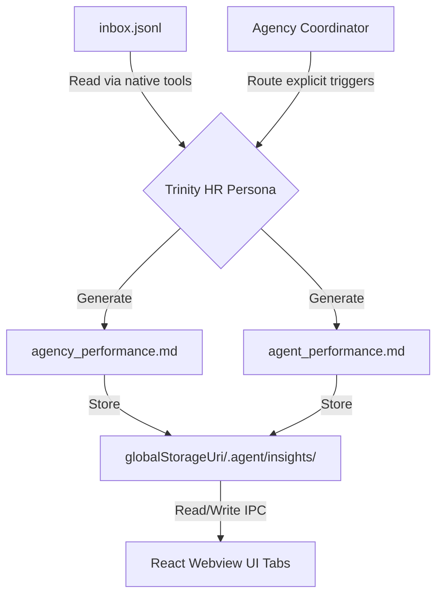

# Devio Client — HR Agent Trinity Architecture Spec

**Prepared by:** agency-architect
**Date:** 2026-06-19
**Status:** DRAFT

---

## 1. System Overview

This architecture document specifies the technical design for integrating the "Trinity" HR agent persona into the Devio AI Development Agency workflow.
The solution utilizes native built-in tools (`view_file`, `grep_search`) for Trinity to autonomously read and query `inbox.jsonl`, eliminating the need for a custom parser script. Trinity will generate structured Company-level and Agent-level performance insights, stored locally in `globalStorageUri/.agent/insights/`. The React Webview UI will be expanded to include "Company Insights" and "Insights Manager" tabs to natively view and manage these reports. Strict file size constraints will be enforced to mitigate LLM context window exhaustion. Coordinator routing will be updated to trigger Trinity at explicit points to establish a State-of-the-Art (SOTA) Reflection & Critic Loop without bottlenecking the main workflow.

---

## 2. Architecture Diagram

---

## 3. Component Breakdown

### 3.1 Trinity HR Persona
**Purpose:** To act as the Human Resources and Performance Analyst for the Devio agency, identifying workflow inefficiencies and generating structured performance reports using native tools.
**Technology Choice:** Markdown (`.agent/skills/agency-trinity/SKILL.md`).
**Rationale:** Standard Devio agent persona definition, enabling seamless orchestration by the Coordinator and full utilization of built-in file/search tools.

### 3.2 Insights Local Storage
**Purpose:** To provide persistent storage for generated performance insights.
**Technology Choice:** File system storage within `globalStorageUri/.agent/insights/`.
**Rationale:** Leverages the native VS Code extension global storage mechanism for workspace-independent access.

### 3.3 Webview UI Integration
**Purpose:** To allow users to view and manage company and agent insights natively.
**Technology Choice:** React Webview components ("Company Insights" and "Agent/Company Insights Manager" tabs) with Node.js IPC backing.
**Rationale:** Seamless integration into the existing Devio Antigravity Plugin UI for a consolidated user experience.

### 3.4 Coordinator Routing Updates
**Purpose:** To securely orchestrate Trinity's execution within the agency lifecycle under specific triggers.
**Technology Choice:** Markdown (`.agent/skills/agency-coordinator/SKILL.md`).
**Rationale:** Routing logic must be updated natively within the Coordinator's skill definition to invoke Trinity during Post-Mortem, Escalation/Deadlock Intervention, and Periodic Background Audits to maximize inter-agent communication without blocking the critical path.

---

## 4. API Contract

The communication and data storage rely on a file-based contract mediated by the Extension Host IPC.

**Company Insights (`globalStorageUri/.agent/insights/agency_performance.md`):**
A structured markdown file detailing global bottlenecks, team velocity, and overall protocol adherence.

**Agent Insights (`globalStorageUri/.agent/insights/{agent_name}_performance.md`):**
Structured markdown files detailing individual protocol violations, recurring feedback, and individual strengths/weaknesses.

---

## 5. Data Model

**Insight Documents Structure:**
- **Header:** Agent or Company Name
- **Summary:** High-level performance metrics
- **Key Findings:** Detailed insights and diagnostic events
- **Recommendations:** Actionable feedback for improvement
- **Size Constraint:** Enforced rolling log or truncation (Max 500 lines)

---

## 6. Infrastructure & Deployment

- **Runtime:** Node.js >= 22 (Active LTS). The actual runtime version is controlled by the host VS Code/Antigravity IDE Electron version.
- **Dependencies:** 0 new npm runtime dependencies.
- **Deployment:** Insights stored securely via the VS Code extension `globalStorageUri` mechanism.
- **Data Handling:** Insight documents are strictly capped (e.g., max 500 lines) to prevent LLM context window exhaustion. All analytics remain within the local workspace limits.

---

## 7. Implementation Task List

1. **T-01: Develop Insights Storage & Webview UI**
   - **Estimated Hours:** 2 hours
   - **Dependencies:** None
   - **Acceptance Criteria:** Local storage mechanism established at `globalStorageUri/.agent/insights/`. React Webview UI updated with a "Company Insights" tab and an "Insights Manager" for viewing and editing data. IPC routes established.

2. **T-02: Define Trinity HR Persona & Reporting**
   - **Estimated Hours:** 1 hour
   - **Dependencies:** T-01
   - **Acceptance Criteria:** `.agent/skills/agency-trinity/SKILL.md` is created, defining instructions to use native tools to read `inbox.jsonl`, generate Company and Agent reports, and strictly enforce the 500-line max file size constraint via rolling logs or truncation.

3. **T-03: Update Coordinator Routing Rules**
   - **Estimated Hours:** 1 hour
   - **Dependencies:** T-02
   - **Acceptance Criteria:** `.agent/skills/agency-coordinator/SKILL.md` is updated to invoke Trinity at explicit triggers:
     - Post-Mortem Analysis (end of cycle)
     - Escalation/Deadlock Intervention (>3 consecutive REQUEST_CHANGE messages)
     - Periodic Background Audit (e.g., every 50 messages)

---

## 8. Open Technical Decisions

- **Truncation Strategy:** The specific mechanism for file truncation (e.g., discarding oldest log entries vs summarization into a meta-insight) is deferred to Trinity's skill implementation, provided the 500-line limit is strictly and deterministically adhered to.
