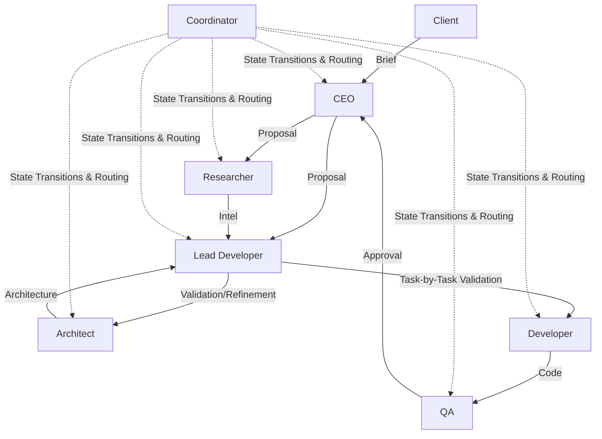
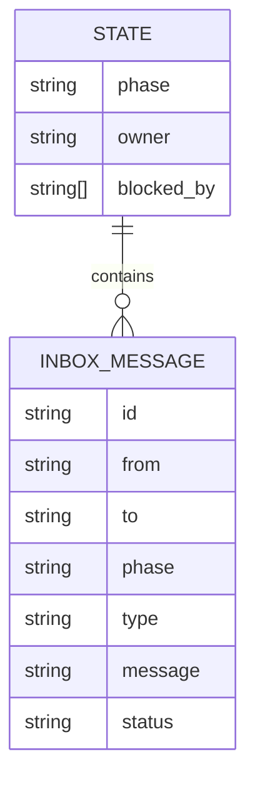

# 03 Architecture Specification — Devio v0.8.0 (Lead Developer Integration)

**Prepared by:** agency-architect (Neo)
**Date:** 2026-06-19
**Status:** DRAFT (Pending Validation)

---

## 1. System Overview

This architecture integrates the new "Lead Developer" (`agency-lead-developer`) persona into the Devio multi-agent workflow. The Lead Developer ("Le Merovingien") acts as a pragmatic architect, delivery facilitator, and technical liaison, ensuring that high-level client requirements are translated into rigorously researched, task-by-task execution plans.

## 2. Component Breakdown

### 2.1 Lead Developer Agent Profile (`agency-lead-developer/SKILL.md`)
- **Purpose:** Defines the persona "Le Merovingien", providing instructions on how to act as the Pragmatic Architect, Technical Liaison, and Delivery Facilitator.
- **Technology Choice:** Markdown with YAML frontmatter (standard Devio skill format).
- **Rationale:** Aligns with existing Devio agent profile structure for seamless integration into the prompt builder and workflow.

### 2.2 Phase Protocol Updates (`PROPOSAL` & `ARCHITECTURE`)
- **Purpose:** Updates the routing and state machine logic managed by `agency-coordinator` to enforce the Lead Developer's mandatory review and sign-off.
- **Technology Choice:** TypeScript (in `orchestrator.ts` or `prompt-builder.ts` where phase logic resides).
- **Rationale:** The Coordinator handles phase transitions. Adding a required review step by `agency-lead-developer` ensures the new protocols are strictly enforced.

### 2.3 Task-by-Task Validation Schema
- **Purpose:** Standardizes the format of `03_architecture.md` (this very document style) to require discrete, atomic tasks that the Lead Developer can individually validate against research.
- **Technology Choice:** Markdown standard operating procedure (SOP).
- **Rationale:** Ensures no vague requirements pass through to the Developer.

## 3. API Contract

No new external API endpoints are introduced. The internal message bus (`inbox.jsonl`) will handle new routing message types:
- `REQUEST_RESEARCH` (from Lead Developer to Researcher)
- `VALIDATE_TASK` (from Lead Developer to Architect)
- `CHALLENGE_SPEC` (from Developer/Lead Developer to Architect)

## 4. Data Model

The existing `state.json` and `inbox.jsonl` models remain, with the addition of the new persona.

## 5. Infrastructure & Deployment

- **Deployment:** The `agency-lead-developer` skill directory and associated files will be packaged into the VSIX extension and deployed to the `globalStorageUri`, following the v0.7.6 packaging protocols.
- **Cost:** Negligible; handled locally or via standard LLM API interactions.

## 6. Implementation Task List

This task list is formatted for step-by-step validation by the Lead Developer.

| Task ID | Task Name | Description | Est. Hours | Dependencies | Acceptance Criteria |
| :--- | :--- | :--- | :--- | :--- | :--- |
| **DEV-01** | Create `agency-lead-developer` skill file | Write `SKILL.md` for "Le Merovingien" encompassing Pragmatic Architect, Technical Liaison, and Delivery Facilitator roles. | 2 | None | `SKILL.md` exists globally and strictly defines communication protocols with CEO, Researcher, and Architect. |
| **DEV-02** | Update `agency-coordinator` routing logic | Modify coordinator scripts/rules to inject the Lead Developer into the `PROPOSAL` and `ARCHITECTURE` phases as a mandatory reviewer. | 4 | DEV-01 | Coordinator blocks phase transition to DEVELOPMENT until the Lead Developer issues an `APPROVE` message. |
| **DEV-03** | Update Architecture Checklist | Modify `references/architecture_checklist.md` to mandate step-by-step task breakdowns and explicit research cross-referencing. | 1 | None | Checklist includes explicit validation instructions for the Lead Developer. |

## 7. Open Technical Decisions

- **Handling Deadlocks:** If the Lead Developer and CEO fundamentally disagree on scope during the `PROPOSAL` phase, we may need the Coordinator (or Trinity) to resolve the deadlock. For now, the Coordinator's existing escalation mechanism will be used.
