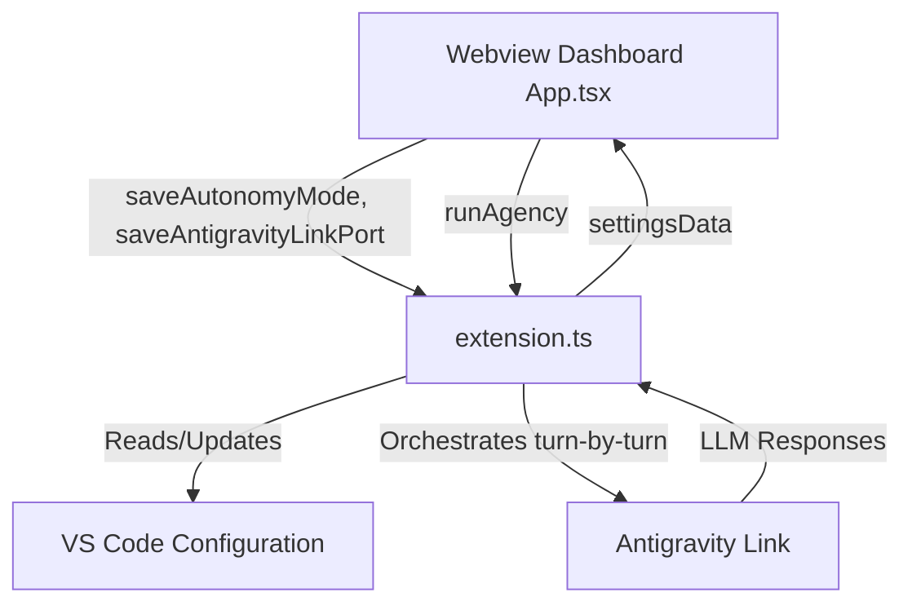

# Devio Workspace: Editable Settings and Step-by-Step Mode Architecture

## System Overview
The proposed updates enhance the Devio AI Agency Extension and its React webview dashboard to support editable autonomy modes and custom Antigravity Link ports, along with a supervised execution mode. This allows users to review agent interactions step-by-step and modify execution settings directly from the UI without manually altering VS Code settings.

## Architecture Diagram

## Component Breakdown
1. **React Webview (`App.tsx`)**
   - **Purpose**: Render the user interface, including settings fields and control buttons.
   - **Technology**: React, Vite.
   - **Rationale**: Existing architecture uses React. Adding state variables (`autonomyMode`, `antigravityLinkPort`) ensures reactive UI updates.

2. **Extension Backend (`extension.ts`)**
   - **Purpose**: Bridge VS Code settings with the webview and orchestrate the LLM loops.
   - **Technology**: TypeScript, VS Code Extension API.
   - **Rationale**: Acts as the central controller, managing `vscode.workspace.getConfiguration` and handling the `runAgency` loop logic.

3. **Antigravity Link Extension**
   - **Purpose**: Interact with the LLM.
   - **Technology**: VS Code Extension.
   - **Rationale**: Existing component.

## API Contract
- **Webview to Extension (Messages)**:
  - `saveAutonomyMode(mode: string)`
  - `saveAntigravityLinkPort(port: number)`
  - `runAgency()`
- **Extension to Webview (Messages)**:
  - `settingsData(autonomyMode: string, antigravityLinkPort: number, ...)`

## Data Model
| Entity | Type | Default | Source of Truth |
| --- | --- | --- | --- |
| `devio.autonomyMode` | string | 'supervised' | VS Code Configuration |
| `devio.antigravityLinkPort` | number | 3717 | VS Code Configuration |

## Infrastructure & Deployment
- **Where it runs**: Local VS Code instance.
- **How it is deployed**: VS Code extension package (`.vsix`).
- **Cloud costs**: €0.

## Open Technical Decisions
- None. The `isGenerating` state requires no custom handling when pausing in supervised mode. `OrchestrationEngine.runTurn()` natively polls and blocks until `!snap.isGenerating` is true. When `runTurn()` completes, the state is naturally false, and the loop simply breaks and posts `{ type: 'agencyRunning', isRunning: false }` to the webview.

---

## Implementation Task List

### Task 1: Make Autonomy Mode and Port Settings Editable in Webview
- **Estimated Hours**: 4
- **Dependencies**: None
- **Acceptance Criteria**:
  - `App.tsx` has reactive state variables for `autonomyMode` and `antigravityLinkPort`.
  - The `disabled` properties are removed from the Autonomy Mode select and Antigravity Link Port input fields.
  - `onChange` events dispatch `saveAutonomyMode` and `saveAntigravityLinkPort` messages to the extension backend.
  - The port input only accepts numerical values.

### Task 2: Implement Backend Settings Integration in Extension
- **Estimated Hours**: 3
- **Dependencies**: Task 1
- **Acceptance Criteria**:
  - `extension.ts` updates `getSettingsData` to correctly read `devio.autonomyMode` and `devio.antigravityLinkPort` from VS Code configuration and send them to the webview.
  - `extension.ts` implements message handlers for `saveAutonomyMode` and `saveAntigravityLinkPort` from the webview.
  - These handlers use `vscode.workspace.getConfiguration('devio').update(...)` to save the new values globally.

*(Further tasks will be provided pending Lead Developer validation of Task 2)*

### Task 3: Implement Step-by-Step Supervised Execution Mode
- **Estimated Hours**: 4
- **Dependencies**: Task 2
- **Acceptance Criteria**:
  - `extension.ts` modifies the `runAgency` orchestration loop to check the current `devio.autonomyMode`.
  - If `autonomyMode` is `'supervised'`, the execution loop halts and breaks after a single execution of `runTurn()`, returning control to the user.
  - The webview UI updates to reflect the paused execution state by receiving `{ type: 'agencyRunning', isRunning: false }`, which naturally hides the typing indicator and restores the 'Continue' (or 'Run Agency') button to execute the next prompt. No custom `isGenerating` toggling is required.
  - If `autonomyMode` is `'autonomous'`, the loop executes continuously until the end state is reached.
