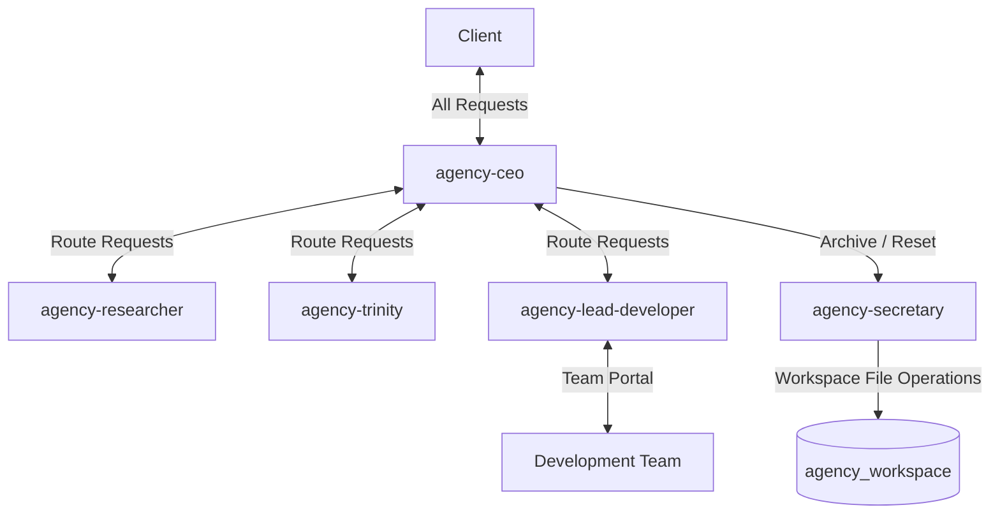

# Architecture: Devio Agency Orchestration Update v0.9.0

## System Overview
The Devio Agency orchestration model is being restructured to improve client communication and agency efficiency. The `agency-coordinator` role is completely deprecated and all its references must be removed. The `agency-ceo` assumes direct control of orchestration, acting as the single point of contact for the client and routing internal requests to the appropriate personas. A new `agency-secretary` (Nyobe) role is introduced strictly for archiving and workspace state management. Strict Test-Driven Development (TDD) protocols are enforced throughout the development lifecycle, along with a strict ban on direct message bus file editing.

## Architecture Diagram

## Component Breakdown
1. **`agency-ceo` (Skill Update)**
   - **Purpose:** Primary point of contact for the client, orchestrator of the agency loop, routing tasks.
   - **Technology Choice:** Markdown (`SKILL.md`) instructional update.
   - **Rationale:** The client demanded direct interaction with the CEO to resolve inefficiencies introduced by the Coordinator.

2. **`agency-secretary` (New Skill)**
   - **Purpose:** Replaces the Coordinator for file management. Archives the workspace to prepare for new engagements. **CRITICAL TIMING:** Archiving MUST strictly occur in the `DONE` phase, immediately after `agency-trinity` completes her post-mortem analysis.
   - **Technology Choice:** Markdown (`SKILL.md`) creation.
   - **Rationale:** Abstracts workspace cleanup from the CEO to maintain focus on client and team management, while ensuring proper sequencing with HR/post-mortem tasks.

3. **`agency-researcher` (Skill Update)**
   - **Purpose:** Perform in-depth research, including advanced web search and page content extraction, instead of superficial internet searches.
   - **Technology Choice:** Markdown (`SKILL.md`) instructional update.
   - **Rationale:** The client demanded higher quality research that actually searches on-page net contents.

4. **All Agents Protocol Update**
   - **Purpose:** Enforce a strict ban on injecting messages into the message bus via file edition tools or commands.
   - **Technology Choice:** Markdown (`SKILL.md`) update across all personas.
   - **Rationale:** The client strictly requires agents to never inject messages by file edition tools. Only the final JSON should be retrieved and sent natively.

3. **`agency-lead-developer` (Skill Update)**
   - **Purpose:** Acts as the team portal to the CEO.
   - **Technology Choice:** Markdown (`SKILL.md`) instructional update.
   - **Rationale:** Ensures structured communication between the business/management tier (CEO) and the technical execution tier.

4. **Message Bus Protocol**
   - **Purpose:** Define routing rules.
   - **Technology Choice:** JSONL (`inbox.jsonl`) / Markdown (`message_types.md`).
   - **Rationale:** Must reflect the new CEO-centric routing architecture.

## API Contract
N/A - the system relies on file-based message bus (`inbox.jsonl`) operations which remain structurally unchanged, only the routing logic within the payloads changes.

## Data Model
The message bus (`inbox.jsonl`) schema remains intact as defined in `message_types.md`.
- `from`: Will increasingly see `agency-ceo` as the source for orchestration.
- `to`: Client messages will strictly target `agency-ceo`.

## Infrastructure & Deployment
- **Where it runs:** Locally within the Devio Antigravity VSCode Plugin environment.
- **Cost:** €0 cloud cost.
- **Deployment:** Packaged as `devio-antigravity-plugin-0.9.0.vsix`.

## Implementation Task List
1. **Task 1: Update `agency-ceo` skill to handle orchestration**
   - **Estimated Hours:** 2
   - **Dependencies:** None
   - **Acceptance Criteria:** `SKILL.md` is updated to instruct the CEO to manage client requests and redirect to Researcher, Trinity, or Merovingien.
   - **Cross-Reference:** Client Intel "CEO is the single point of contact".

2. **Task 2: Create `agency-secretary` skill and deprecate `agency-coordinator`**
   - **Estimated Hours:** 3
   - **Dependencies:** Task 1
   - **Acceptance Criteria:** A new `SKILL.md` for `agency-secretary` exists detailing workspace archiving. The skill must explicitly state that archiving triggers ONLY in the `DONE` phase after `agency-trinity` has completed her job. It must also explicitly state that the CEO or Lead Developer can ask the Secretary (Nyobe) for the context path. `agency-coordinator` skill and all associated metadata and insights are completely removed from the project.
   - **Cross-Reference:** Client Intel "Coordinator role is deprecated" and Client Feedback "archivate file in done phase after trinity does her job".

3. **Task 3: Update `agency-researcher` skill for Advanced Search**
   - **Estimated Hours:** 1
   - **Dependencies:** None
   - **Acceptance Criteria:** `SKILL.md` for `agency-researcher` is updated to explicitly require advanced, in-depth research techniques, including actually searching and extracting content from pages on the net, rather than superficial searches.

4. **Task 4: Enforce Global "No File Edition" Message Bus Rule**
   - **Estimated Hours:** 2
   - **Dependencies:** None
   - **Acceptance Criteria:** Every agent's `SKILL.md` must be updated with a critical rule: "NEVER INJECT MESSAGE ON THE BUS BY FILE EDITION TOOLS OR COMMAND. only the final json should be retrieved". CEO file editing violations must be addressed.

3. **Task 3: Update `agency-lead-developer` skill**
   - **Estimated Hours:** 1
   - **Dependencies:** Task 1
   - **Acceptance Criteria:** `SKILL.md` updated to establish the Lead Developer as the sole portal communicating with the CEO.
   - **Cross-Reference:** Proposal "Lead Developer as primary team portal".

4. **Task 4: Enforce TDD Protocols and Update Message Types**
   - **Estimated Hours:** 4
   - **Dependencies:** Task 2, Task 3
   - **Acceptance Criteria:** Development skills and `message_types.md` are updated to enforce TDD before delivery. Test suites written for routing logic.
   - **Cross-Reference:** Proposal "Enforcing strict Test-Driven Development".

## Open Technical Decisions
- **Secretary File Permissions:** It is assumed the Secretary will have sufficient OS permissions to move files to the `archive` directory. If not, fallback manual instructions may be required.
